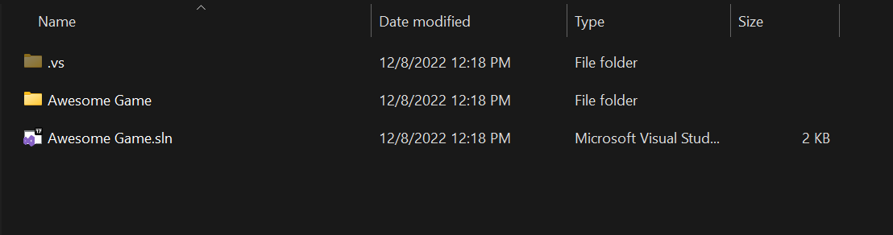
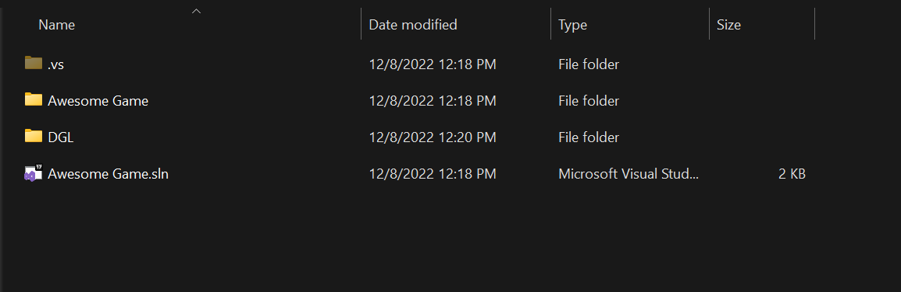
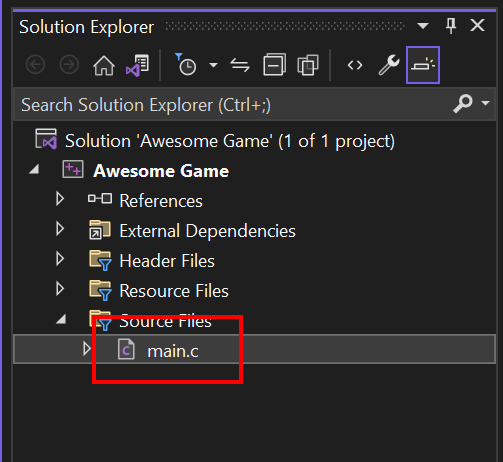
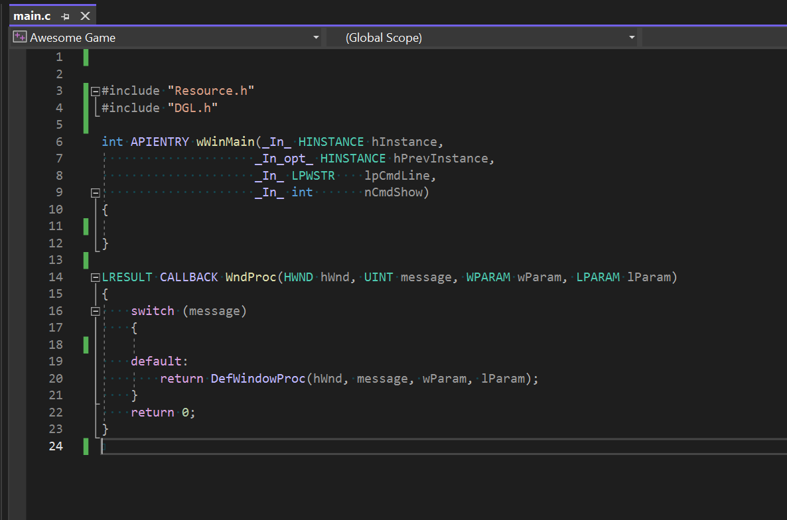

# Creating a New Visual Studio Project

Open Visual Studio and select the "Create a new project" option.

Scroll down until you find the "Windows Desktop Application" option, select it, and then click the "Next" button.

Change the project name to whatever you want, and choose the location where you want to save the project. Keep the "Place solution and project in the same directory" option un-checked. This will create a sub-folder for the project files, which we want to do. Then click on the "Create" button.

When you look at the folder where you created your project, you should see a .sln file with the name of the project, and a folder with the same name. 

Inside the folder you should see a list of files like this (with your project name instead of "New Game Project").

Put the DGL folder into the base folder of your project, like this:

Double-click on the .sln file to open the solution. When you expand the "Source Files" filter you should see a .cpp file with the name of your project.

Right-click on the file, choose the "Rename" option, and rename the file to main.c.

 

Expand the "Header Files" filter, and delete the .h file with your project name. We won't be using this file.

Open the main.c file. We will be deleting most of the text in the file. You will want to keep the WinMain and WndProc functions, but remove all the code from WinMain and most of the code from WndProc. You should end up with a file that looks like this:

Right-click on the project name to open the project property settings. Make sure that the "Configuration" setting is set to "All Configurations" and the "Platform" setting is set to "All Platforms".

